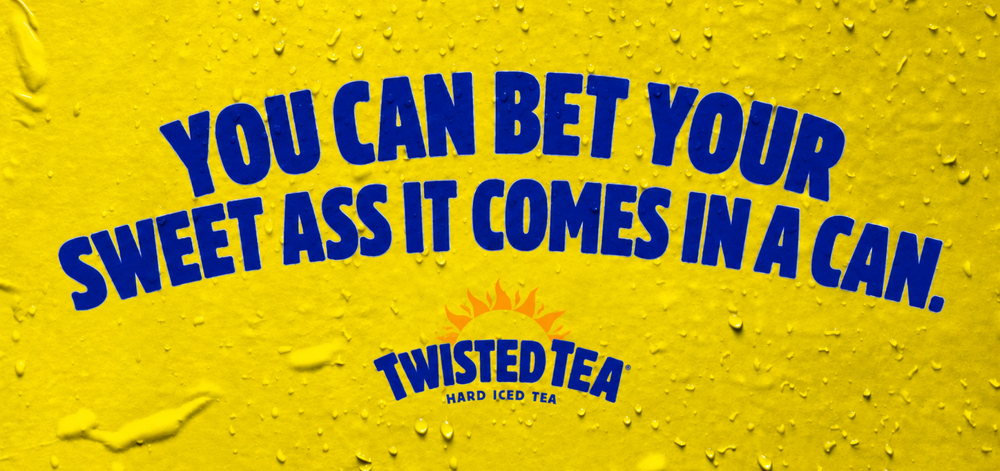
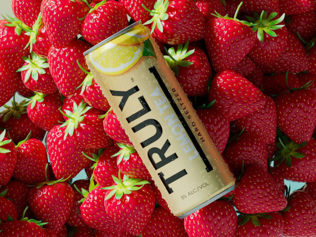
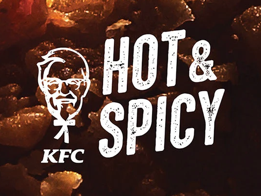
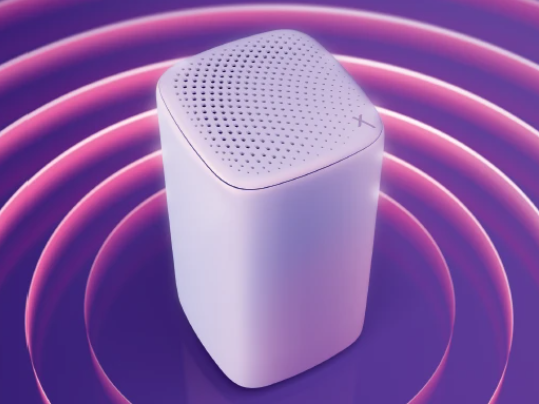
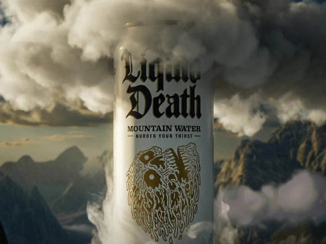

# Brand Engines

*Full-parameter GPT-2 fine-tuning, checkpoint branching, and sequential transfer learning for brand-specific language generation — 2021 PROJECT ARCHIVE.*

In May 2021, I was still an Art Director at one of the country’s top advertising agencies, ChatGPT was 18 months away, and I had just finished my first major machine-learning project. This is that project, with minor maintenance updates/repairs.

  
  
  
  

I started the project in 2020, building a GPU cluster in my kitchen and fine-tuning GPT-2 until it could do my job. In a secret [John Henry](https://en.wikipedia.org/wiki/John_Henry_(folklore)) style competition, it went head-to-head with seasoned creative directors in a new-business pitch. Except this time, the machine came out on top, and we signed a new client to the agency. Here's an email from that day:

*Jeff Goodby (yes, the advertising legend who invented “Got Milk?”) reacting to early brand-engine outputs, May 2021.*

The trick to getting much higher quality outputs was to train first on much larger *style* corpora (Kurt Vonnegut, @dril, the Bible; anything with a distinctive and singular voice) and then fine-tune further on content for a specific brand: headlines, strategy, commercial scripts, and other campaign work.

Start with [Jeff's personal favorites](sample-archive/twisted_tea/01-jeffs-favorites.csv), or browse a small selection of the generated work for [Twisted Tea](sample-archive/twisted_tea/), [Truly](sample-archive/truly/), [KFC](sample-archive/kfc/), [Xfinity](sample-archive/xfinity/), and [Liquid Death](sample-archive/liquid_death/).

We made it easy for anyone to create an engine with a single drag and drop interface. Pick a base model, upload a .txt file, and watch it train, generating samples all along the way.

https://github.com/user-attachments/assets/f324a29f-a900-44d1-9434-db526123ba4f

## Run locally

See the [local setup guide](run/local.md) for setup, model downloads, and a walkthrough. Once dependencies are installed, `npm run local` starts the interface and API at <http://127.0.0.1:3017>. Live generation and training require an NVIDIA GPU; the sample collections and video above can be viewed without installing anything. Fine-tuned weights and training datasets are not included in this repository.

## Inside the project

The application connects a Next.js interface to a Django API, which runs GPT-2 training and generation in separate worker processes. Branching copies a selected checkpoint and records its ancestry, allowing a style-trained model to become the starting point for a brand-specific engine.

- [Model and training code](gpt_2/src/): GPT-2, tokenization, sampling, full-parameter fine-tuning, and checkpoint handling.
- [Backend](backend/): model management, branch metadata, dataset uploads, and worker execution.
- [Interface](frontend/): generation, branching, training progress, and saved sample history.
- [Sample archive](sample-archive/): curated outputs organized by brand.

The model implementation builds on [OpenAI's GPT-2](https://github.com/openai/gpt-2) and the [fine-tuning fork by nshepperd](https://github.com/nshepperd/gpt-2); see [source attribution and license](gpt_2/LICENSE). The application, workflow, and brand experiments sit on top of that foundation. The [runtime notes](run/local.md#runtime-compatibility-and-checks) describe compatibility updates and checkpoint limitations.
